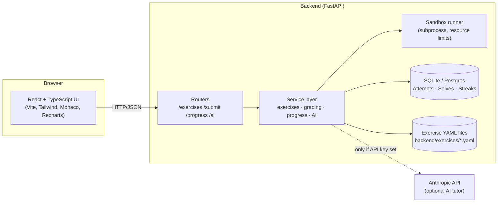

# Python Coding Trainer

**Practice Python with instant feedback.** An interactive coding trainer with a
built-in editor, sandboxed grading, progressive hints, and progress
tracking — no setup required beyond `docker-compose up`.

[](backend)
[](frontend)
[](backend)
[](LICENSE)
[](.github/workflows/ci.yml)

---

## Why I built this

Learning to code is mostly about reps — write something small, find out
immediately whether it's right, fix it, repeat. Most "learn Python"
resources are either static tutorials with no feedback loop, or full LMS
platforms with way more surface area than a focused practice tool needs.
This is the tool in between: a fast, good-looking, self-contained trainer
you can run in a minute and actually enjoy using.

## Demo

<!-- screenshot placeholders — see docs/screenshots/README.md for what to add -->
| Landing | Exercise Browser |
|---|---|
|  |  |

| Workspace | Dashboard |
|---|---|
|  |  |

*(Screenshots not yet added — see [docs/screenshots](docs/screenshots) for instructions.)*

## Features

- **25+ bundled exercises** across 12 topics (variables, control flow,
  functions, data structures, strings, comprehensions, error handling,
  OOP, file I/O, recursion, algorithms, decorators) and all three
  difficulty levels.
- **In-browser Monaco editor** pre-filled with starter code, with Python
  syntax highlighting.
- **Instant grading** against hidden test cases, with a readable
  expected-vs-actual diff on failure and full tracebacks for runtime
  errors.
- **Progressive hints** — reveal one at a time instead of jumping to the
  answer.
- **Progress tracking** — solved exercises, streaks, per-topic mastery,
  and a 30-day activity chart, all backed by SQLite (swap-in Postgres
  supported).
- **Optional AI tutor mode** — if `ANTHROPIC_API_KEY` is set, the backend
  can generate a fresh custom exercise on demand, or give a natural-language
  code review of a failed attempt. The app is fully functional without it.
- **Dark mode**, responsive layout, loading/empty states, and a small
  success animation when you solve something.
- **Secure sandboxed code execution** — see [Security & sandboxing](#security--sandboxing) below.

## Architecture



**Layout:**

```
backend/
  app/
    routers/       # FastAPI route handlers (thin)
    services/       # business logic: grading, progress, exercises, AI
    sandbox/         # subprocess-based grading harness + runner
    models.py        # SQLAlchemy ORM models
    schemas.py        # Pydantic request/response schemas
  exercises/         # one YAML file per exercise (source of truth)
  alembic/            # DB migrations
  tests/               # pytest suite
frontend/
  src/
    api/            # typed API client
    components/      # ui/ primitives + feature components
    pages/            # Landing, Exercises, ExerciseWorkspace, Dashboard
    context/            # theme + toast providers
    hooks/                # data-fetching hooks
```

## Tech stack

**Backend:** FastAPI · SQLAlchemy 2.0 · Alembic · Pydantic v2 · SQLite
(Postgres-ready) · pytest · slowapi (rate limiting)

**Frontend:** React 19 · TypeScript · Vite · Tailwind CSS · Monaco Editor ·
Recharts · React Router · Vitest + Testing Library

**Infra:** Docker + docker-compose · GitHub Actions CI

## Getting started

**Prerequisites (Option 2 only):** Python 3.11+, Node.js 22.19+ (jsdom's
bundled `undici` requires it — an older Node will fail when running the
frontend test suite). Option 1 (Docker) has no host prerequisites beyond
Docker itself.

### Option 1 — one command with Docker (recommended)

```bash
docker-compose up --build
```

Then open **http://localhost:5173**. The backend API and docs are at
http://localhost:8000/docs.

### Option 2 — run backend and frontend separately

**Backend:**

```bash
cd backend
python -m venv .venv
.venv\Scripts\activate      # Windows
# source .venv/bin/activate  # macOS/Linux
pip install -r requirements.txt
cp .env.example .env         # optional: add ANTHROPIC_API_KEY here to enable AI mode
uvicorn app.main:app --reload
```

The backend runs at http://localhost:8000 (interactive docs at `/docs`).
Tables are created automatically on first run for local development; for
production-style schema management use Alembic instead:

```bash
alembic upgrade head
```

**Frontend** (in a second terminal):

```bash
cd frontend
npm install
npm run dev
```

The frontend runs at http://localhost:5173 and proxies `/api` requests to
the backend automatically (see `frontend/vite.config.ts`).

### Running tests

```bash
# Backend
cd backend && pytest -v

# Frontend
cd frontend && npm test
```

## Security & sandboxing

User-submitted code is graded by spawning it as a **separate OS process**,
never via `eval`/`exec` of a shell string:

- The submission is written to a plain `.py` file in a throwaway temp
  directory, and a trusted harness script (`backend/app/sandbox/harness.py`)
  is launched as a fresh Python subprocess with that directory as its `cwd`.
- **Wall-clock timeout** is enforced by the parent process
  (`subprocess.run(..., timeout=...)`), cross-platform.
- **On POSIX**, the parent additionally applies CPU-time and address-space
  (memory) `rlimit`s via `preexec_fn` before the interpreter even starts.
  Windows has no rlimit equivalent exposed to Python, so on Windows only
  the wall-clock timeout applies — a known, documented limitation.
- Before importing the submission, the harness disables `socket.socket`
  (blocking network access) and wraps `open`/`io.open` so file access
  outside the scratch directory raises `PermissionError`.

This is **defense-in-depth appropriate for a local coding-practice tool**,
not a hard multi-tenant security boundary. If you wanted to expose this to
fully untrusted internet-scale traffic, run the sandbox inside a real
container/VM boundary (gVisor, Firecracker, or Docker with
`--network=none` and a read-only rootfs) in addition to the above. See
`backend/app/sandbox/harness.py` and `backend/app/sandbox/runner.py` for
the full implementation and inline documentation.

## Deployment notes

Want a live demo link instead of just the repo? Both services deploy
cleanly to free tiers:

**Backend → [Render](https://render.com) or [Railway](https://railway.app)**
- Point either at the `backend/` directory (or use `backend/Dockerfile`).
- Set the start command to `uvicorn app.main:app --host 0.0.0.0 --port $PORT`.
- Set `FRONTEND_ORIGIN` to your deployed frontend URL for CORS.
- SQLite works for a demo; attach a persistent disk if you want data to
  survive restarts, or point `DATABASE_URL` at a managed Postgres instance.

**Frontend → [Vercel](https://vercel.com) or [Netlify](https://netlify.com)**
- Point either at the `frontend/` directory. Build command `npm run build`,
  output directory `dist`.
- Since the frontend calls the API at `/api/...`, either configure a proxy
  rewrite to your backend URL (Vercel: `vercel.json` rewrites; Netlify:
  `_redirects`), or set an environment-based `baseURL` in
  `frontend/src/api/client.ts` pointing at your deployed backend.

## Publish this to GitHub

If you're new to git, here's the exact sequence to get this repo onto
GitHub. Run these from the project root.

```bash
git init
git add .
git commit -m "Initial commit: Python Coding Trainer"
```

- `git init` — turns this folder into a git repository.
- `git add .` — stages every file for the first commit.
- `git commit -m "..."` — saves that snapshot with a message.

Then create an **empty** repository on GitHub (no README/license — this
project already has those): go to https://github.com/new, name it, and
click "Create repository". GitHub will show you a remote URL like
`https://github.com/<you>/<repo>.git`. Connect and push:

```bash
git remote add origin https://github.com/<you>/<repo>.git
git branch -M main
git push -u origin main
```

- `git remote add origin <url>` — tells git where "GitHub" is.
- `git branch -M main` — names your branch `main`.
- `git push -u origin main` — uploads your commit and remembers this
  remote for future `git push` calls.

Prefer a script? Run `bash scripts/publish_to_github.sh` — it walks you
through the same steps interactively.

## Contributing

See [CONTRIBUTING.md](CONTRIBUTING.md), including how to add a new
exercise (it's just a YAML file, no code changes needed).

## License

[MIT](LICENSE)
